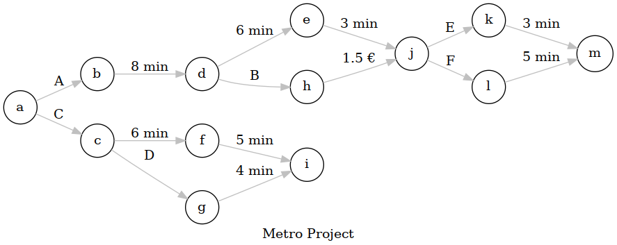

# Project goal
This project was developped in order to get more familiar with Rust by developping a simple application: "Given a graph show a path to go from a starting point to a target destination under some conditions".

# The Use Case
The app is based in a fictional metro plan. The plan is illustrated in the figure below: 



The nodes of the graph represent the stations and the edges represent 3 type of possible transitions: 
- changing to another metro Line (lines are represented by Uppercase letters)
- Paying an extra feed
- commuting time between two stations

The idea is to find all possible paths/ or the shortest path that bring you from une starting point to another.

The graph should use the same funcions to deal with all the transitions.


# Methodology
So I started this project by crating all the structues needed for it. I identified the following:

[`Station`](./src/main.rs#L10): to represent the nodes. I implemented `fmt::Display` and `Deref` for it.

[`Transit`](./src/main.rs#L37): An `Enum` to deal with the transition types (Adding one new transition type will be to add an option to the `Enum`)

[`Edge`](./src/main.rs#L73): De edge *per se* to track the connection between two stations and the corresponding `Transit`

[`Graph`](./src/main.rs#L97): The graph having the global picture of all the stations and links between them.

The next step was to fill the graph. for that the [`add_node`](./src/main.rs#L103) and [`add_edge`](./src/main.rs#L111) methods where developped, and some getters for those where also implemented [here](./src/main.rs#L118-126).

Now it remained the problem on how to find the "shortest path" from one node to another or "all possible paths".

My firt thought went to being able to add consecutive edges, so I implemented [`std::ops::Add`](https://docs.rs/rustc-std-workspace-std/1.0.1/std/ops/trait.Add.html) for `Transit`. 

Then I implemented a graph search approach to explore the graph.

# My Pain Points

Not all came as easy I would have hoped so, here I will list some of my pain points, and how I overcame them (or not):

## Using `Add`
The use of Add consummes the elements being added! Oh Yes, so I had to invite clone and 

## The ownership, oh the ownership!
Stations and edges belong to who, who should be able to modify them, when? First ideas went to the graph owning a `Vec< >` of stations and another of edges. Each edge will kept track odf its begenning and end as indices in the graph list and similarly, stations will kept track of its neighbourgs by their indices. Sounds simple and simple is always better, till you try to find the path and realize that you have to get acces to the neighbours of a neighbour and so to the element in a recursive way. 

The proposed solution, which is probably improvable, was to change the graph fields as `Vec<Rc<RefCell< >>>`. Having the ownership of that vector shared between the graph and the nodes (for their neighbours).

## Recursivity
One of the widely used approach for graph exploration is the [Depth-first search (DFS)](https://en.wikipedia.org/wiki/Depth-first_search) 
> The algorithm starts at the root node (selecting some arbitrary node as the root node in the case of a graph) and explores as far as possible along each branch before backtracking.

This algorithm uses recursivity. I tried and failed to use this function: 

```rust
    fn shortest_path(self, from: usize, to:usize) {
        let mut neigh_paths:Vec<Vec<usize>> = Vec::new();
        let mut neighs = Vec::new();
        neighs.push(from);
        fn find_neigh (curr_neigh: Vec<usize>, goal: usize, &neighs: Vec<usize>) -> Vec<usize>{
            let mut chaine = neighs.clone();
            for n in curr_neigh{
                chaine.push(n);
                if n != goal {
                    find_neigh(n, goal, &chaine);
                } else {
                    break;
                }
            }
            neighs 
        };
        println!("{:?}", find_neigh(from, to, neighs));
    }
```
Why? I needed to have access to the context (self) for it to work (actually get the neighbours). Easy solution: use **closures**. 

[Closures](https://doc.rust-lang.org/book/ch13-01-closures.html) are anonymous functions that capture their environment. New problem, recursion is "not possible" with closures :disappointed: . Possible solution: we need an `Rc` to share a reference to the closure, inside the closure itself. The trick is that we need to create that shared reference before the closure so that it can be embedded. The ownership here is a nightmare!

## And so...
I endded up switching to python and testing in Python different search approaches and optimizing them to get all search paths.

By doing this I realized that using the [Breadth-first search (BFS)](https://en.wikipedia.org/wiki/Breadth-first_search) approach relief me from the recursion issue and actually oin the Python test was faster than DFS!

# Possible improvements
A lot of things can be improve in this code:

- [ ] Probably  we don't need the graph edges to be `Vec<Rc<RefCell< >>>` and change to `Vec<Edges>` will suffice

- [ ] Implement the DFS approach (with recursive closures) and compare agains BFS

- [ ] Change transit to take generic type `<T: Display, merge(or Add), get_str_value>`, this will allow for any new transit type
